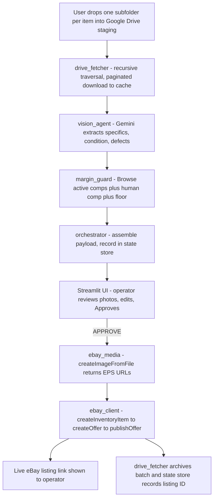
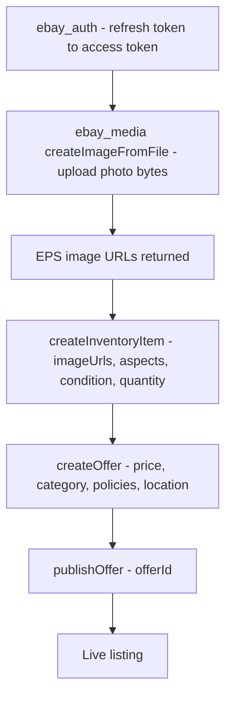
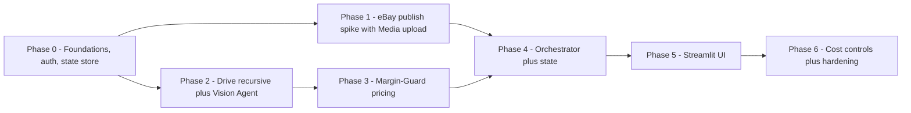

# Product Deployment Blueprint — Lister-Bridge Hybrid Agent

**Version:** 1.1 · **Date:** June 27, 2026 · **Status:** Build-ready — decisions committed
**Grounding:** Full read of the ELB repository + external verification of eBay and Gemini APIs (June 2026).
**Formatting:** Generated through the `hfe-mayer` skill (HFE + Mayer cognitive-load rules).
**This revision:** see the Revision log at the end. Major change — eBay listing path committed to REST; GraphQL preview path dropped; image upload via Media API; pricing rebased on active comps.

---

## Executive summary

**What we are building.** A single-user, local tool that converts phone photos of items — dropped into a Google Drive folder, one subfolder per item — into accurate, priced eBay listings, with a mandatory human approval gate before anything goes live. Gemini extracts item specifics, condition, and defects; pricing is anchored on live comparable listings and confirmed by the operator; the tool uploads the photos and publishes to eBay.

**Current state, one line.** Planning and governance are complete; only 1 of ~9 backend modules is built (Google Drive I/O), and it needs an enhancement — the AI core, eBay integration, state store, auth, and UI are unbuilt, so **the project does not yet run**.

**Decisions committed this revision (all approved).**

| Area | Committed decision |
|---|---|
| eBay publish | **REST Sell Inventory API**: `createInventoryItem` → `createOffer` → `publishOffer` (amends C-002) |
| eBay images | **Media API `createImageFromFile`** — upload photo bytes, get an EPS URL (no public bucket needed) |
| eBay previews | **GraphQL Inventory Mapping API dropped** — the Vision Agent already extracts specifics |
| Pricing | **Active-comp anchored** (Browse API) + **human-confirmed** comp + **deterministic floor** |
| AI | **Gemini 3.5 Flash** (GA) behind a swappable provider interface; start on AI Studio free tier |
| UI | **Streamlit** review/approve, superseding the logged CLI-only decision |
| Governance | **Right-sized** — keep decision log + FMEA; drop the heavy two-phase/Kanban/spike ceremony |

**Path to a working product (6 phases).** Foundations (deps, config, auth, state store) → eBay publish spike in sandbox, including image upload (highest risk first) → Drive enhancement + Vision Agent → Margin-Guard pricing → orchestrator pipeline + state → Streamlit UI → cost controls and hardening. The eBay spike and the Drive/Vision work depend only on completed code, so they run **in parallel**.

**This changes if** scope grows beyond single-user / US-only selling, or eBay deprecates the REST Inventory publish flow — either forces re-architecture of the integration layer.

---

## Current-state assessment

The repository is a well-documented scaffold with one working module. The hard, high-risk work has not started.

| Module | File | Status | Notes |
|---|---|---|---|
| Drive I/O | `src/core/drive_fetcher.py` | **Built — needs enhancement** | Solid backoff/cache/archive; must add recursive subfolder traversal + pagination (see change below). |
| Orchestrator | `src/core/orchestrator.py` | **Missing** | README entry point does not exist. |
| State store | `src/core/state_store.py` | **Missing (new)** | Dedup, resume, SKU + listing IDs, token cache. |
| Provider iface | `src/ai/provider.py` | **Missing (new)** | Vendor/model abstraction. |
| Vision Agent | `src/ai/vision_agent.py` | **Missing** | Gemini extraction. |
| Margin-Guard | `src/ai/margin_guard.py` | **Missing** | Pricing (rebased input). |
| eBay auth | `src/api/ebay_auth.py` | **Missing (new)** | OAuth refresh → access token. |
| eBay client | `src/api/ebay_client.py` | **Missing** | Browse comps, Media upload, REST publish. |
| UI | `src/ui/app.py` | **Missing (new)** | Streamlit review/approve. |

**Foundation gaps that block a clean clone-and-run:** `requirements.txt` covers only the three Drive libraries; `.env.example` omits the Gemini and eBay variables the README requires; minor doc drift in template filenames and the prompt-headers file.

**This changes if** there is uncommitted local work beyond the read tree — this reflects committed/working files, not a `git` history diff.

---

## Target product definition and UX flow

A local, single-operator listing assistant. The confirmed end-to-end flow:



In words the diagram cannot show: the operator triggers a **Scan** in the app; the pipeline runs vision and pricing per item; the review screen pairs each item's **photos** with its extracted specifics, condition, defect list, and suggested price; nothing publishes until the operator types/clicks **Approve**.

**UI supersedes the CLI-only decision (called out).** DECISION 4 chose an interactive CLI and rejected richer interfaces. That is reversed here for one concrete reason: **the core task is judging item photos against extracted data**, and a terminal cannot render images. The pipeline stays headless and scriptable; Streamlit becomes the default front end; a CLI/headless mode remains available. Formal supersession is logged below.

**Open option (recommended to include):** allow **direct photo upload inside the GUI** in addition to Drive capture — trivial in Streamlit and useful when the operator is already at the computer.

**This changes if** the operator insists on a keyboard-only terminal workflow and will review images in a separate viewer — then a Textual TUI is the lighter path.

---

## System architecture

The pipeline is linear with one human gate. The orchestrator owns sequencing and state; presentation is a thin layer so the UI and a headless mode share one core. Auth and the state store are cross-cutting.

| Layer | Module | Responsibility | Key FMEA |
|---|---|---|---|
| **Core** | `drive_fetcher.py` | Recursive Drive poll, paginated cached download, archive | PI-001 |
| **Core** | `orchestrator.py` | Sequencing, per-item state, context flush | PI-003 |
| **Core** | `state_store.py` | SQLite: processed batches, SKUs, listing/offer IDs, token cache | R-STATE |
| **AI** | `provider.py` | Swappable model/vendor interface (config-driven) | R-COST |
| **AI** | `vision_agent.py` | Aspect/condition/defect extraction | PI-004, PI-005 |
| **AI** | `margin_guard.py` | Active-comp anchor + human comp + deterministic floor | PI-006 |
| **eBay** | `ebay_auth.py` | OAuth refresh-token storage + access-token renewal | R-AUTH |
| **eBay** | `ebay_client.py` | Browse comps, Media upload, REST publish, pre-submit validation | PI-009, R-IMG |
| **UI** | `ui/app.py` | Photo review, edit, approval gate, optional upload | PI-007, PI-008 |

**eBay publish sub-sequence** (committed REST path, with auth and image upload):



**This changes if** eBay introduces a single-call listing-creation method — the three-step REST sequence would collapse.

---

## Verified external dependencies and APIs

### eBay listing path — committed to REST (evidence-first)

- **Repo originally assumed:** publish via the GraphQL `startListingPreviewsCreation` mutation (C-002).
- **Evidence (June 2026):** that mutation belongs to the **Inventory Mapping API** and only generates asynchronous AI *previews* (US-only); it does **not** publish. Live listings are created by the **REST Sell Inventory API** (`createInventoryItem` → `createOffer` → `publishOffer`).
- **Decision:** adopt REST as the publish backbone and **drop the GraphQL preview path entirely** — the Vision Agent already produces item specifics, so the preview API is redundant and its async task/notification polling is avoided. C-002 is amended accordingly.

eBay prerequisites for publishing: an OAuth 2.0 **user** token (handled by `ebay_auth.py`), a merchant **inventory location**, and **fulfillment / payment / return** business policies referenced by ID in every offer.

### eBay images — Media API `createImageFromFile`

- **Mechanism:** upload the photo **bytes** (already downloaded from Drive) via `createImageFromFile` (multipart/form-data); eBay returns an **EPS URL** used in `product.imageUrls`. No public bucket or public Drive link is needed — that earlier plan is removed.
- **Do not use** the legacy Trading API `UploadSiteHostedPictures` — deprecated, decommissioned **2026-09-30**.
- **Constraints to enforce before upload:** up to **24 free photos/listing** (40 rolling out); **12 MB/image**; **~1600 px** long side recommended; supported formats include JPG, PNG, WEBP, and **HEIC** (matches the Drive fetcher's iPhone handling). EPS images not attached to a listing are purged after **30 days** — a non-issue because we publish immediately.

**This changes if** eBay alters EPS limits or retires `createImageFromFile` — re-check the Media API before build.

### eBay pricing data — active comps, not sold comps (evidence-first)

- **Conflict:** the original Margin-Guard assumed comparable **sold** prices. eBay sold-price data is gated behind the **Marketplace Insights API** (limited release, not obtainable for a small single-user project), and the legacy Finding API is deprecated.
- **Resolution — three inputs:**
  1. **Browse API `item_summary/search`** — active comparable listings as the automated "current asking" anchor (filter by condition and price; FIXED_PRICE by default).
  2. **Human-in-the-loop** — the GUI surfaces a Terapeak/sold-search link so the operator confirms or enters a true sold-comp price.
  3. **Deterministic floor** `(cost + fees) * 1.15` — the guaranteed backstop, retained.
- **Reframe:** pricing is **active-comp anchored + human-confirmed + floor-protected**, not sold-comp driven.

**This changes if** the seller obtains Marketplace Insights access — then real sold comps can replace the active-comp anchor.

### Gemini — assumptions valid; pin the model

`thinking_level: HIGH`, `media_resolution: HIGH`, and the "Gemini 3 Flash" family are all real as of 2026; current GA is **Gemini 3.5 Flash**. Add the `google-genai` SDK (missing today) and pin the model in config. Cost is order-of-cents per listing — see Cost & Fallback.

### Google Drive — built, requires enhancement

Service-account auth, cached downloads, and archiving are built (PI-001). Two requirements added this revision: **recursive subfolder traversal** (staging → per-item subfolders → images) and **full pagination** via `pageToken`, so nothing past the 100-item page size is dropped (fixes assumption A-01).

---

## Cost and fallback

Cost is low but must be controlled deliberately so a misconfiguration cannot run up a bill.

- **Start free:** develop on the **Google AI Studio free tier**; move to the paid API only when needed.
- **Provider abstraction:** all AI calls go through `provider.py`, so the model or vendor is swappable via config without touching pipeline code.
- **Cost levers:** lower `media_resolution` for simple images; use a smaller tier (Flash-Lite) for cheap text steps; use the **Batch API (~50% off)** for any non-interactive run; **cache per-item results** in the state store so a resume never re-charges completed items.
- **Budget guardrail:** set a **Google Cloud budget alert**.
- **Billing note:** consumer **Google One / AI Pro** subscriptions do **not** include Gemini **API** tokens — API usage is billed separately.

**This changes if** monthly volume rises sharply — at that point batch-mode and caching move from "nice to have" to required, and a cost ceiling should gate publishing.

---

## Data contracts and schemas

Contracts are fixed now so the unbuilt modules develop against stable interfaces.

**Vision Agent output → Margin-Guard input** (forced defect list mitigates PI-004):

```json
{
  "item_specifics": {},
  "condition": "",
  "defects_found": [],
  "dropped_fields": []
}
```

**Margin-Guard output** (rebased on active comps + human confirmation):

```json
{
  "margin_guard_price": 0.00,
  "active_comp_anchor": 0.00,
  "user_confirmed_comp": null,
  "floor_price": 0.00,
  "floor_applied": false,
  "active_comp_range": { "low": 0.00, "high": 0.00 },
  "reasoning": "",
  "missing_inputs": []
}
```

**Listing payload → eBay** (explicit mapping, no dynamic inference):

| Internal field | eBay target | Call |
|---|---|---|
| photo bytes | (upload) → EPS URL | Media `createImageFromFile` |
| EPS URLs | `product.imageUrls` | createInventoryItem |
| `title`, `item_specifics`, `condition` | `product.title`, `product.aspects`, `condition` | createInventoryItem |
| `quantity` | `availability...quantity` | createInventoryItem |
| `margin_guard_price` | `pricingSummary.price` | createOffer |
| `category_id`, policies, location | `categoryId`, `listingPolicies`, `merchantLocationKey` | createOffer |

**State store (SQLite) — items table** (≤7 columns):

| Column | Meaning |
|---|---|
| `item_sku` | Deterministic SKU (idempotency key) |
| `batch_folder_id` | Drive subfolder ID |
| `status` | new / extracted / priced / published / error |
| `offer_id` | eBay offer ID |
| `listing_id` | eBay listing ID (once live) |
| `eps_urls` | Uploaded image URLs |
| `updated_at` | Timestamp |

**SKU / idempotency strategy:** derive the SKU deterministically from the Drive subfolder ID (e.g., `LB-{folderId}`); before processing, check the state store and skip anything already `published`; record `offer_id` / `listing_id` immediately after each eBay call so a crash-and-resume never double-publishes.

**This changes if** multi-variation listings are needed — that adds inventory item groups and `publishOfferByInventoryItemGroup`.

---

## Build plan

Dependency-ordered, highest-risk-first, next buildable slice at the front. Acceptance criteria are boolean.



### Phase 0 — Foundations (do first)

- [ ] `requirements.txt` and `.env.example` updated (see Deployment); Gemini model pinned in config.
- [ ] `provider.py` interface, `ebay_auth.py` (OAuth refresh), and `state_store.py` scaffolded.
- [ ] C-002 amendment and DECISION 4 supersession logged.

### Phase 1 — eBay publish spike, sandbox (highest risk)

- [ ] OAuth user token auto-refreshes in the eBay **sandbox**.
- [ ] A local photo uploads via `createImageFromFile` and returns a usable **EPS URL**.
- [ ] A hardcoded payload publishes a live **sandbox** listing via `createInventoryItem` → `createOffer` → `publishOffer`.
- [ ] Inventory location + three business policies created and referenced.

### Phase 2 — Drive enhancement + Vision Agent (parallel with Phase 1)

- [ ] `drive_fetcher` traverses per-item **subfolders recursively** and paginates fully (no 100-item ceiling).
- [ ] `vision_agent` returns schema-valid JSON with a forced `defects_found` array (PI-004).
- [ ] Aspects validated against eBay category enums; invalid values dropped, not invented (PI-005).

### Phase 3 — Margin-Guard pricing

- [ ] Browse API returns active comps used as the anchor; `active_comp_range` populated.
- [ ] Deterministic floor overrides when below floor and sets `floor_applied` (PI-006).
- [ ] Missing cost or comp routes to `missing_inputs` for the UI, never guessed.

### Phase 4 — Orchestrator + state

- [ ] Runs drive → vision → pricing per item; records each step in the state store.
- [ ] Dedup skips already-published SKUs; resume continues after interruption.
- [ ] Gemini context flushed after each item (PI-003).

### Phase 5 — Streamlit UI

- [ ] Review screen shows photos beside specifics/condition/defects + suggested price.
- [ ] Resolves `dropped_fields` / `missing_inputs`; requires explicit **Approve** to publish (PI-007); no raw JSON (PI-008).
- [ ] Optional in-GUI photo upload available alongside Drive capture.

### Phase 6 — Cost controls + hardening

- [ ] Batch API and per-item caching wired; Google Cloud budget alert set.
- [ ] Image pre-checks (size/format/dimensions) before upload (R-IMG).
- [ ] Unit tests for floor logic, schema validation, SKU idempotency, and mapping.

**This changes if** the Phase 1 spike fails — a blocked publish path re-orders everything and is the most important early signal.

---

## Deployment blueprint

**Environment.** Python 3.11+ locally (Windows confirmed; the Drive fetcher already uses Windows-safe file replacement). Use a virtual environment. Sandbox-first for all eBay calls.

**Dependency manifest** (replaces the Drive-only file; SQLite is stdlib, no dependency):

```text
# Core / IO (existing)
google-api-python-client>=2.100.0
google-auth>=2.22.0
python-dotenv>=1.0.0
# AI (Gemini) — add
google-genai>=1.0.0
# eBay REST + Browse + Media (HTTP)
requests>=2.31
# Data contracts
pydantic>=2.0
# UI
streamlit>=1.36
```

**Config and secrets** (add to `.env` and `.env.example` alongside the existing Drive variables):

```text
GEMINI_API_KEY=
GEMINI_MODEL=gemini-3.5-flash
EBAY_ENV=sandbox
EBAY_CLIENT_ID=
EBAY_CLIENT_SECRET=
EBAY_OAUTH_REFRESH_TOKEN=
EBAY_OAUTH_SCOPES=sell.inventory commerce.media buy.browse
EBAY_MARKETPLACE_ID=EBAY_US
EBAY_FULFILLMENT_POLICY_ID=
EBAY_PAYMENT_POLICY_ID=
EBAY_RETURN_POLICY_ID=
EBAY_INVENTORY_LOCATION_KEY=
```

**Run steps.** (1) Create venv, `pip install -r requirements.txt`. (2) Copy `.env.example` to `.env`; populate Drive, Gemini, and eBay sandbox values. (3) `streamlit run src/ui/app.py`; click **Scan**. (4) Headless mode: `python -m src.core.orchestrator`.

**This changes if** the tool is later packaged for non-technical use — that adds bundling and secrets management beyond a local `.env`.

---

## Risks and mitigations

Updated from the repo FMEA; eBay integration risks first.

| ID | Risk | Effect | Severity | Mitigation |
|---|---|---|---|---|
| **R-IMG** | Image rejected (size/format/dimension) | Publish fails | High | Pre-check 12 MB / ~1600 px / allowed formats before `createImageFromFile` |
| **R-AUTH** | OAuth access token expires (~2h) | Pipeline stalls | High | `ebay_auth.py` stores refresh token, auto-renews |
| **R-PRICE** | No sold-comp data (Insights gated) | Mispricing | High | Active-comp anchor + human-confirmed comp + floor |
| **R-COST** | API spend/quota overrun | Surprise bill | Medium | Free tier start, batch, caching, budget alert |
| **R-STATE** | Duplicate or re-published listings | Bad data, dup fees | Medium | State-store dedup + deterministic SKU + recorded listing IDs |
| PI-007 | Operator approves flawed payload | Bad listing live | RPN 280 | UI diff + explicit Approve |
| PI-003 | Context-window token bloat | Orchestrator crash | RPN 240 | Flush Gemini context per item |
| PI-004 | Vision misses defects | INAD returns | RPN 224 | Forced `defects_found` confirmation |
| PI-005 | Vision hallucinates aspects | Accuracy flags | RPN 168 | Validate against category enums; drop invalid |
| PI-008 | Raw JSON overwhelms operator | Blind approvals | RPN 160 | UI summary: photos + tidy table |
| PI-006 | Unviable price | Misses sell-through | RPN 144 | Deterministic floor overrides |
| PI-009 | Payload rejected by eBay | Offer error | RPN 70 | Validate required Offer fields before `publishOffer` |
| PI-002 | `.env` credential exposure | Account/credit abuse | (mitig.) | `.gitignore` + pre-commit secret scan |
| PI-001 | Drive sync failure | Pipeline halt | (done) | Backoff + cache fallback (built) |

The GraphQL async-polling risk from v1.0 is **removed** — that path no longer exists. The public-image-hosting risk is **removed** — the Media API supersedes it.

**This changes if** a new failure mode surfaces during the Phase 1 spike — record it in the FMEA before proceeding.

---

## Logged decisions and amendments

Per the project's Constraint Change Protocol and FMEA amendment rule, the following are logged with this revision.

| ID | Decision / amendment | Rationale |
|---|---|---|
| **Amend C-002** | eBay publish: GraphQL mutation → **REST Inventory API** | Verified: the GraphQL preview API does not publish |
| **Drop GraphQL preview** | Remove Inventory Mapping API (supersedes v1.0 "optional enrichment") | Vision Agent already extracts specifics; removes async polling |
| **Supersede DECISION 4** | Interactive CLI → **Streamlit UI** (CLI kept as headless mode) | Photo review requires image rendering |
| **DECISION D-9** | Pin **Gemini 3.5 Flash** via `google-genai`, behind `provider.py` | Current GA; vendor-swappable |
| **DECISION D-10** | **Right-size governance** — keep decision log + FMEA living; drop two-phase commit, Kanban WIP, spike-lock | Single-user, single-developer tool |
| **Open option** | Allow GUI **direct upload** in addition to Drive capture | Low effort in Streamlit; operator convenience |

**On governance (evidence-first).** The repo's process scaffolding (two-phase commit with mandatory HALT, housekeeping sessions, CI spike-lock) is well-built but disproportionate for one module and one developer; the overhead competes with shipping. Recommendation retained: keep the FMEA and a single decision log (real value for the eBay-risk paper trail); suspend the multi-session ceremony until there is more than one contributor.

**This changes if** the project takes on collaborators — the heavier governance then earns its weight and should be reinstated.

---

## References (verified June 2026)

- eBay REST Inventory — `publishOffer`: https://developer.ebay.com/api-docs/sell/inventory/resources/offer/methods/publishOffer
- eBay REST Inventory — `createOffer`: https://developer.ebay.com/api-docs/sell/inventory/resources/offer/methods/createOffer
- eBay Media API — `createImageFromFile`: https://developer.ebay.com/api-docs/commerce/media/resources/image/methods/createImageFromFile
- eBay managing image media: https://developer.ebay.com/api-docs/sell/static/inventory/managing-image-media.html
- eBay Browse API — `item_summary/search`: https://developer.ebay.com/api-docs/buy/browse/resources/item_summary/methods/search
- eBay Marketplace Insights (gating): https://developer.ebay.com/api-docs/buy/marketplace-insights/static/overview.html
- Gemini 3 developer guide: https://ai.google.dev/gemini-api/docs/gemini-3
- Gemini API pricing: https://ai.google.dev/gemini-api/docs/pricing
- Google AI plans (no API tokens): https://one.google.com/about/google-ai-plans/

---

## Revision log

**v1.1 — June 27, 2026 (all changes approved):**

1. eBay publish path **committed to REST** (`createInventoryItem` → `createOffer` → `publishOffer`); **C-002 amended**.
2. **Dropped the GraphQL Inventory Mapping preview path** entirely (supersedes v1.0's "optional enrichment" note); removed async task/notification polling.
3. Images now via **Media API `createImageFromFile`** (byte upload → EPS URL); **removed the public-bucket / public-Drive-link plan**; noted `UploadSiteHostedPictures` decommission (2026-09-30) and EPS limits.
4. **Pricing rebased**: Browse API active comps + human-confirmed comp + deterministic floor (sold-comp data gated behind Marketplace Insights).
5. Added the **Cost and fallback** section (AI Studio free tier, provider abstraction, batch/cache levers, budget alert; Google One/AI Pro exclude API tokens).
6. Added **`ebay_auth.py`** (OAuth refresh) and **`state_store.py`** (SQLite dedup/resume, SKU idempotency).
7. Drive fetcher requirement: **recursive subfolder traversal + full pagination** (fixes A-01).
8. **Governance right-sized** (kept decision log + FMEA; dropped heavy ceremony).
9. **UI committed to Streamlit** (supersedes DECISION 4); added optional in-GUI upload.
10. Updated `requirements.txt` and `.env`; **pinned Gemini 3.5 Flash**.
11. Updated all three Mermaid diagrams, the risk table, and the data contracts to match.

**v1.0 — June 27, 2026:** initial blueprint; identified the GraphQL-publish conflict and recommended REST; flagged Gemini assumptions as valid.
