# Proposal — v2.0 Closed Pricing Loop + Feature Roadmap

**Purpose:** hand-off plan for Claude Opus execution sessions. The flagship v2.0 feature is a closed pricing loop: Lister-Bridge learns from its own sale outcomes and feeds them back into Margin-Guard pricing. Sections 1–4 spec the loop; Section 5 sequences the follow-on 2.0 features.

**For the executing session:** this repo runs on CLAUDE.md governance — read it first. No code without a queued Issue (Ground Rule 1); two-phase commit with `[AWAITING_HUMAN_APPROVAL]` halts; decisions to `working/CODE_DECISIONS_PATCH.md`; FMEA constraints are immutable in-session (Ground Rule 8) — this proposal requires an FMEA **amendment** (Section 3) via the human gate before implementation sessions B–E. Environment lessons from the v1.2/v1.3 sessions: files are CRLF (`.gitattributes` handles it); streamlit is not installable in the Linux sandbox, so all logic must live in non-Streamlit modules with the UI as a thin renderer; the eBay API surface must be re-verified against live docs — training data is stale.

---

## 1. Why this feature

README success criterion #1 is ">80% 30-day sell-through," but nothing in the pipeline measures whether an item sold. Pricing is a one-shot model guess with no correction signal. The loop instruments the KPI and compounds: every sale makes the next price better. No consumer reseller tool (Vendoo, List Perfectly, Crosslist) closes this loop.

```mermaid
flowchart TD
    A[Publish listing on eBay] --> B[Outcome poller - piggybacks on scan cadence]
    B --> C[(listing_outcomes table in state store)]
    C --> D[Pricing prior - per-category sell-through, days-to-sale]
    D -->|N >= threshold| E[Margin-Guard adjustment, capped +/-15%]
    D -->|N below threshold| F[Display-only evidence on review card]
    E --> G[Operator reviews suggested price]
    C --> H[Stale-listing view - suggested reprice]
    H --> G
    G --> A
```

## 2. Design

### Data model
New SQLite table `listing_outcomes` via StateStore migration (do NOT modify existing tables or `src/contracts/` models — add a new frozen pydantic model `OutcomeRecord` in a new `src/contracts/outcomes.py`, re-exported from `__init__.py`): `sku`, `listing_id`, `category_id`, `published_at`, `published_price`, `status` (ACTIVE / SOLD / ENDED_UNSOLD), `sold_at`, `sold_price`, `days_to_sale`, `last_checked`.

### Components (all dependency-injected, mirroring existing patterns)
| Component | Location | Responsibility |
|---|---|---|
| Outcome poller | `src/core/outcomes.py` | For ACTIVE items < `OUTCOME_POLL_DAYS` old: query eBay for sold/ended status, upsert outcomes. Rate-limited, batched, runs after each scan. |
| eBay status client | extend `src/api/ebay_client.py` | Order/offer status calls. Endpoints TBD by spike (Session A) — candidates: Sell Fulfillment `getOrders`, Sell Inventory `getOffers`. New scope(s) required. |
| Pricing prior | `src/ai/pricing_prior.py` | Aggregate outcomes by category: sell-through rate, median days-to-sale, realized-vs-estimated price ratio. Emits adjustment factor + evidence string. |
| Margin-Guard hook | `src/ai/margin_guard.py` | Optional injected prior (default None → v1.x behavior unchanged). |
| UI evidence + stale view | `src/ui/` | Review card shows prior evidence; stale-listing section lists ACTIVE items > `STALE_DAYS_THRESHOLD` with suggested reprice. Reprice is operator-approved, never automatic. |

### Guardrails (non-negotiable, from the v1 review philosophy)
- **N-gating:** prior is display-only until category N ≥ `PRIOR_MIN_N` (default 30).
- **Adjustment cap:** ±15% (`PRIOR_MAX_ADJUST`); **floor price** per item below which no suggestion goes — prevents feedback racing to the bottom.
- **Human gate:** every reprice is a button the operator clicks; the loop suggests, never acts.
- New env vars (add to `.env.example` + `settings.py` schema + wizard): `OUTCOME_POLL_DAYS`, `PRIOR_MIN_N`, `PRIOR_MAX_ADJUST`, `STALE_DAYS_THRESHOLD`.

## 3. FMEA amendment (draft — human gate approves before Sessions B–E)
Proposed new constraints, numbered in the existing PI-xxx style: feedback loop degrades prices (mitigation: cap + floor + N-gate + human approval); outcome polling exceeds eBay rate limits (mitigation: batch + backoff via existing `_call_with_backoff`, poll only post-scan); outcome data misattributed across SKUs (mitigation: SKU is already the idempotency key; outcomes keyed identically).

## 4. Session breakdown (queue each as an Issue before executing)
1. **Session A — spike (`spike` label, needs linked formalization issue per Ground Rule 7):** verify against live eBay docs which endpoints/scopes report sold + ended status (and whether watcher counts are available at reasonable cost). Deliverable: endpoint choice, scope list, rate-limit budget. HALT for human review.
2. **Session B — data layer:** `OutcomeRecord` contract, `listing_outcomes` migration, StateStore methods, poller with injectable client, full fake-based tests.
3. **Session C — prior:** aggregation math, N-gating, cap/floor, Margin-Guard injection. Property-style tests on the guardrails (adjustment never exceeds cap; never fires under N).
4. **Session D — UI:** evidence on review cards, stale-listing view, settings wizard entries for the new env vars. Logic in non-Streamlit modules.
5. **Session E — reprice action:** `EbayClient` price-revise call, operator-approved button, dedup-safe. Heaviest human gate: live sandbox verification.

Each session: Sonnet-executable with a precise spec (the v1.2/v1.3 pattern — Opus specs and reviews, Sonnet implements) or Opus end-to-end if capacity allows.

## 5. Roadmap — next 2.0 features after the loop

Ordered by leverage; one Issue each when picked up. Items 2 and 4 start with spikes because they depend on third-party API surfaces that must be verified live.

1. **Setup handholding Tiers 1–3** — already specced in `working/ISSUE_QUEUE.md` (smart inputs → fetch-and-pick eBay IDs → guided refresh-token minting). Execute first; onboarding blocks everything else.
2. **Double-sale guard** — "Sold elsewhere" button that ends the eBay listing + marks state locally (spike: current eBay end-listing endpoint; full FB/Mercari API sync is out of scope — their APIs are effectively closed to individuals).
3. **Photo QA coach** — pre-listing vision pass flags missing angles, blur, unphotographed serials/labels, prompting reshoots *before* extraction. Directly serves success criterion #3 (≥95% defect detection) using the existing vision agent, no new APIs.
4. **Comp evidence transparency** — Margin-Guard cites the actual sold comps behind each price (spike: sold-comp data access — public sold listings are gone; Terapeak/Sell Analytics scope and terms need live verification).
5. **Returns feedback → vision tuning** — track returns and "not as described" flags per SKU; feed recurring miss patterns into the vision prompt. Serves success criterion #2 (zero flagged listings) and compounds like the pricing loop.
6. **Headless scheduled scan** — scan on a timer, desktop notification when items await review. Turns the operator's job from "remember to scan" into "respond to a queue."

**Sequencing rationale:** 1 unblocks adoption; the pricing loop (this proposal) starts accumulating data — deploy it early so N grows while other features build; 2 removes the worst failure mode of multi-platform selling; 3 and 5 close the two remaining README success criteria; 4 and 6 are polish on an already-defensible product.
