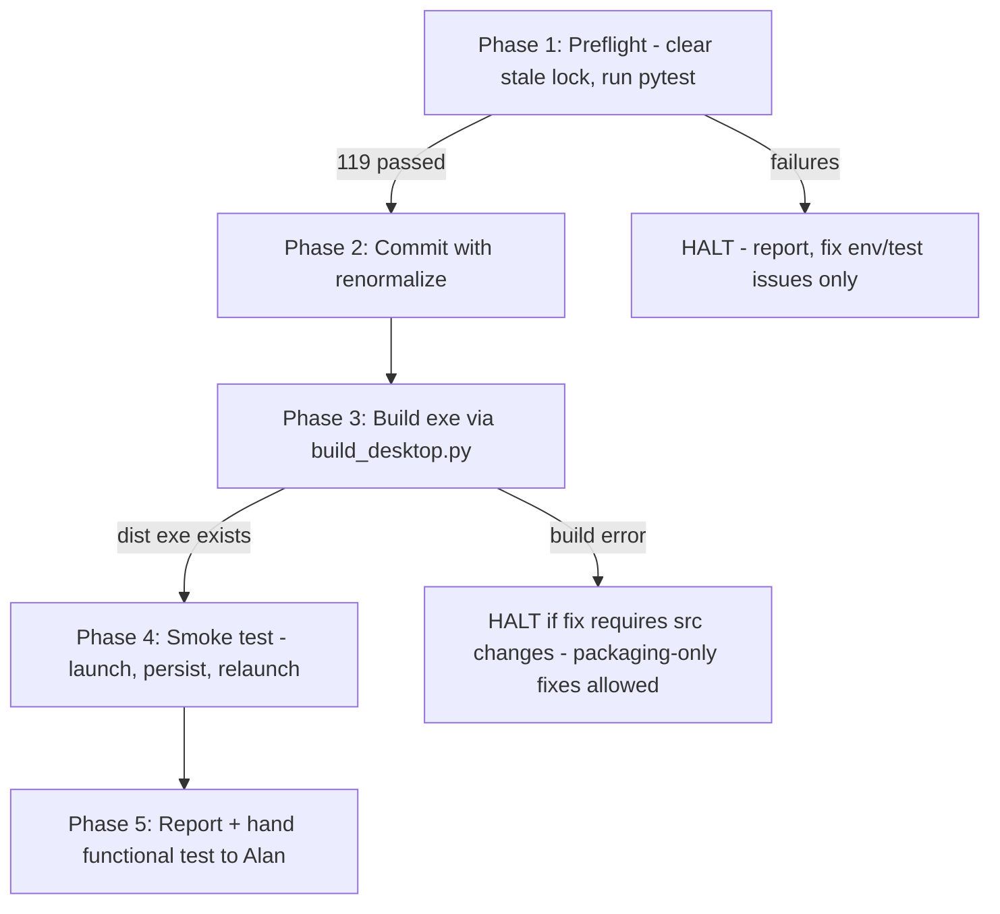

# Session Prompt — Commit, Build .exe, Smoke-Test (v1.2 Hardening)

**Mission:** commit the completed Phase 6 hardening changes, build the single-file Windows .exe via the canonical route, and smoke-test launch + state persistence. This session completes the *mechanical* half of the pending human gate; functional GUI approval (scan/approve round-trip) remains with Alan.

**Session type (per CLAUDE.md):** Execution-support. No new feature code. Kanban: `Awaiting Verification → In Progress`.

## Context — what you are committing

The working tree at `C:\Claude\ELB` contains verified, uncommitted work (119/119 tests passing on Linux; suite must be re-verified on Windows in Phase 1):

| Area | Change |
|---|---|
| Persistence | `src/core/paths.py` (new) — frozen builds anchor state/cache to `%APPDATA%\ListerBridge` |
| Auth | Full-URL OAuth scopes + validation; token cache wired StateStore↔EbayAuth |
| UI | Description edits captured; condition selectbox; single client in `st.session_state`; scan errors displayed |
| Orchestrator | Per-batch error isolation (`ItemStatus.ERROR`); `archive_batch` wired post-publish |
| Packaging | `packaging/lister_bridge.spec` repaired for PyInstaller ≥6; `scripts/build_desktop.py` now delegates to it |
| Hygiene | `.gitattributes` (new), pinned `requirements.txt`, doc-drift patches (GraphQL→REST, CLI→Streamlit) |

Two facts you must expect: **(1)** `.git/index.lock` may be stale (a sandboxed session could not write the index) — safe to delete after confirming no git process is running; **(2)** the new `.gitattributes` will renormalize CRLF, so this one commit shows a large line-ending diff on top of content changes. That is intended.

## Procedure

### Phase 1 — Preflight

1. `cd C:\Claude\ELB`. Confirm no git process is running; if `.git\index.lock` exists, delete it.
2. `git status` — expect modified + new files matching the table above. Investigate anything unexpected before proceeding.
3. Ensure deps: `pip install -r requirements.txt`. Pins were verified on Python 3.10 (Linux); if resolution fails on your Python, adjust the minimum pins needed and log the change to `working/CODE_DECISIONS_PATCH.md`.
4. `python -m pytest -q` — **expect 119 passed.** Any failure: HALT the pipeline, diagnose, fix only environment/test issues (no feature scope), re-run to green before continuing.

### Phase 2 — Commit

1. Append `.claude/` to `.gitignore` (local Claude settings do not belong in the repo).
2. `git add --renormalize .` then `git add -A`. Verify `.env`, `dist/`, `build/`, `.venv/` are NOT staged.
3. Commit message: `v1.2 hardening: frozen-path persistence, OAuth scope fix, token cache wiring, UI edit capture, orchestrator error isolation, archive wiring, packaging consolidation, doc-drift patches (119 tests)`.
4. Push only if the remote is configured and reachable; never force-push.

### Phase 3 — Build

1. `pip install -r requirements-build.txt`.
2. `python scripts/build_desktop.py` (single canonical route — it invokes `packaging/lister_bridge.spec`).
3. Verify the .exe exists under `dist\` and record its size. Build failures may be fixed in `packaging/` or `scripts/build_desktop.py` ONLY; if a fix would touch `src/`, HALT and report instead.

### Phase 4 — Smoke test (no live API calls)

1. Read `desktop_app.py` first to learn the launch mechanism and port.
2. Ensure a `.env` sits next to the .exe (copy the developer's existing `.env` if present; placeholder creds from `.env.example` are fine for a launch test). Never commit it.
3. Launch the .exe; verify the process stays up and the Streamlit UI responds on its localhost port.
4. Verify `%APPDATA%\ListerBridge\` was created and contains the SQLite state DB — this is the R-STATE fix under test.
5. Kill the process, relaunch, confirm the same DB file persists (not recreated empty). Do **not** click Scan/Approve against live eBay or Drive.

### Phase 5 — Report

Produce: pytest count, commit hash, exe path + size, smoke-test results (launch / AppData persistence / relaunch), and any decisions logged. Then state what remains human-only: **(a)** GUI scan→approve round-trip with sandbox credentials, **(b)** first live token refresh (validates the scope-format fix — mocked tests cannot). End with the two-phase-commit status: still `[AWAITING_HUMAN_APPROVAL]` pending Alan's functional test; on his "Approved," a Housekeeping session performs the FMEA audit and the `CODE_DECISION_LOG.md` merge.

## Guardrails

- Ground Rule 11: never remove or truncate existing comments/docstrings.
- No changes to `src/` or `tests/` except Phase 1 test-environment fixes; log every decision to `working/CODE_DECISIONS_PATCH.md`.
- If any project-level fact changes, log it to `working/DOCUMENT_DRIFT_LOG.md`.
- Never commit `.env`, `dist/`, `build/`; never force-push.
