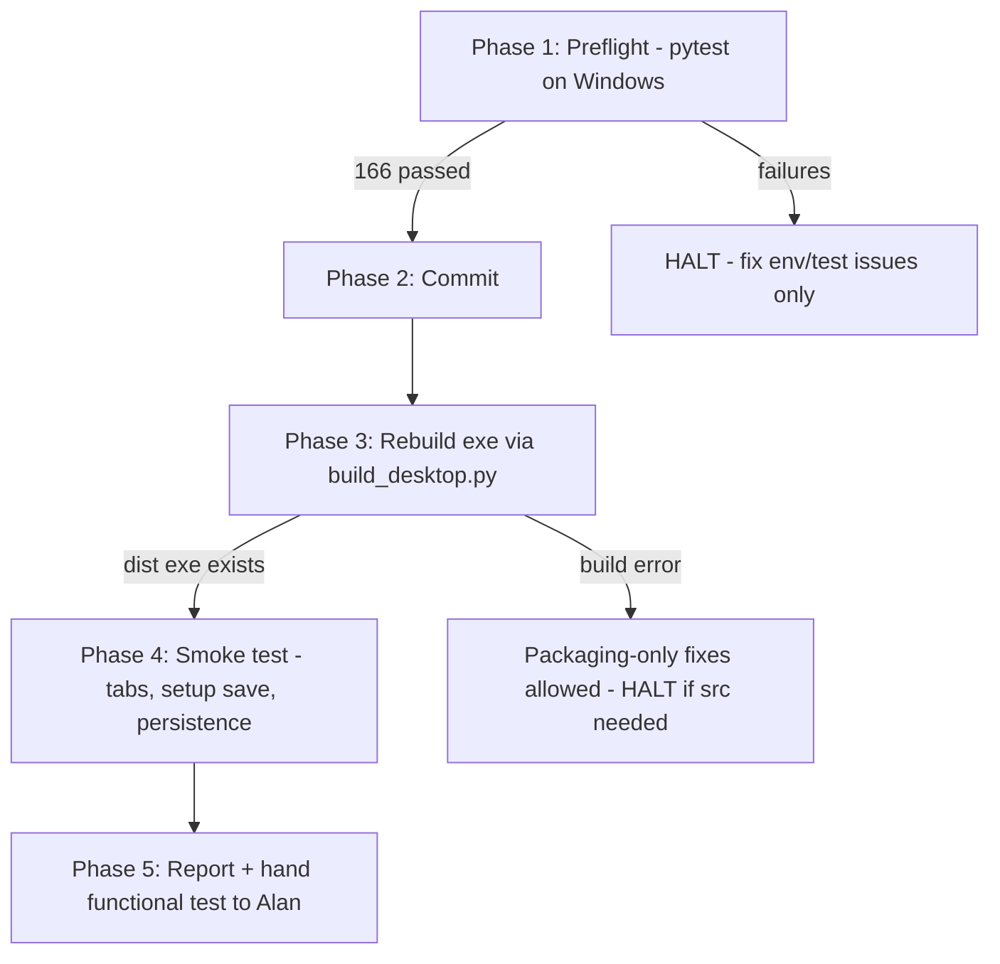

# Session Prompt — Commit, Build .exe, Smoke-Test (v1.3 Usability: Setup Wizard + Tip Sheet)

**Mission:** commit the Phase 7 usability features, rebuild the single-file Windows .exe, and smoke-test the new Setup and Help tabs plus state persistence. This session completes the *mechanical* half of the pending human gate; functional GUI approval remains with Alan.

**Session type (per CLAUDE.md):** Execution-support. No new feature code. Kanban: `Awaiting Verification → In Progress`.

## Context — what you are committing

The working tree at `C:\Claude\ELB` contains verified, uncommitted work (166/166 tests passing on Linux; re-verify on Windows in Phase 1). Prior v1.2 hardening is already committed (`96322b6`).

| Area | Change |
|---|---|
| Setup wizard | `src/core/settings.py` (new) — schema for every `.env` var, portal links, atomic read/write to the frozen-aware `.env` path, live validators (Drive/Gemini/eBay) with DI, shadowing-`.env` detection |
| UI | `src/ui/app.py` — three tabs: Review & approve (unchanged logic), Setup (credential entry, masked secrets, Test + Save buttons, missing-config banner, restart + shadow warnings), Help |
| Tip sheet | `src/ui/help_content.py` (new) — contextual `TIPS` wired to widget `help=`, 7-section Help tab content |
| Tests | `tests/test_settings.py` (36) + `tests/test_help_content.py` (11) — all streamlit-free |
| Governance | `working/CODE_DECISIONS_PATCH.md` Phase 7 decisions; two feature issues in `working/ISSUE_QUEUE.md` |

## Procedure

### Phase 1 — Preflight

1. `cd C:\Claude\ELB`; confirm no git process running; delete `.git\index.lock` only if stale.
2. `git status` — expect new/modified files matching the table above; investigate anything else.
3. `python -m pytest -q` — **expect 166 passed.** Any failure: HALT, fix only environment/test issues, re-run to green.

### Phase 2 — Commit

1. `git add -A`; verify `.env`, `dist/`, `build/`, `.venv/`, `.claude/` are NOT staged.
2. Message: `v1.3 usability: guided credential setup wizard with live validation, in-app tip sheet (Setup/Help tabs), shadowing-.env detection (166 tests)`.
3. Push if remote configured; never force-push.

### Phase 3 — Build

1. `python scripts/build_desktop.py` (canonical route via `packaging/lister_bridge.spec`).
2. Verify the new .exe under `dist\` (record size + timestamp — confirm it replaced the v1.2 binary). Packaging-only fixes allowed; HALT if a fix would touch `src/`.

### Phase 4 — Smoke test (no live API calls)

1. **First-run path:** temporarily rename any `.env` next to the .exe AND `%APPDATA%\ListerBridge\.env`. Launch: the app must show the missing-config warning banner and all three tabs (Review & approve / Setup / Help), not crash.
2. **Setup tab:** enter placeholder values, Save — verify success message names `%APPDATA%\ListerBridge\.env`, tells the user to restart, and the file was written with the entered keys. Do NOT click Test buttons with placeholder creds (they will correctly fail — one failing Test is fine to confirm error rendering is human-readable).
3. **Shadow warning:** restore the exe-adjacent `.env` and Save again — verify the precedence warning appears naming that file.
4. **Help tab:** renders all sections; contextual tooltips appear on Scan/condition/description/Approve widgets.
5. **Persistence regression:** restore real `.env`, launch, kill, relaunch — `%APPDATA%\ListerBridge` DB persists. No live Scan/Approve.

### Phase 5 — Report

Produce: pytest count, commit hash, exe path/size, smoke results per Phase 4 item, decisions logged. Remaining human-only: **(a)** real-credential Test buttons on the Setup tab, **(b)** GUI scan→approve round-trip, **(c)** readability pass on the Help tab content — Alan is the audience. End with two-phase-commit status: `[AWAITING_HUMAN_APPROVAL]` pending Alan's functional test; on "Approved," Housekeeping performs the FMEA audit and `CODE_DECISION_LOG.md` merge.

## Guardrails

- Ground Rule 11: never remove or truncate existing comments/docstrings.
- No changes to `src/` or `tests/` except Phase 1 test-environment fixes; log decisions to `working/CODE_DECISIONS_PATCH.md`.
- Project-level fact changes → `working/DOCUMENT_DRIFT_LOG.md`.
- Never commit `.env`, `dist/`, `build/`; never force-push.
